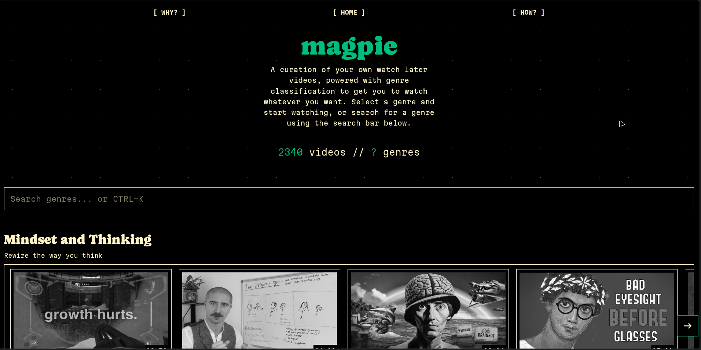
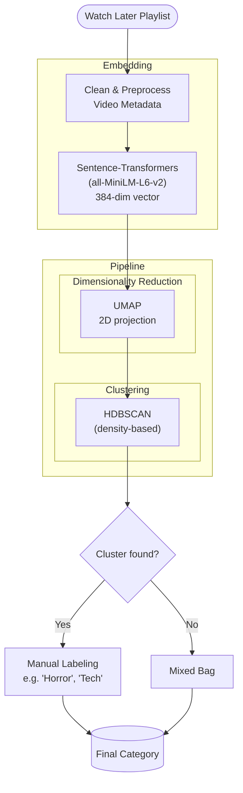
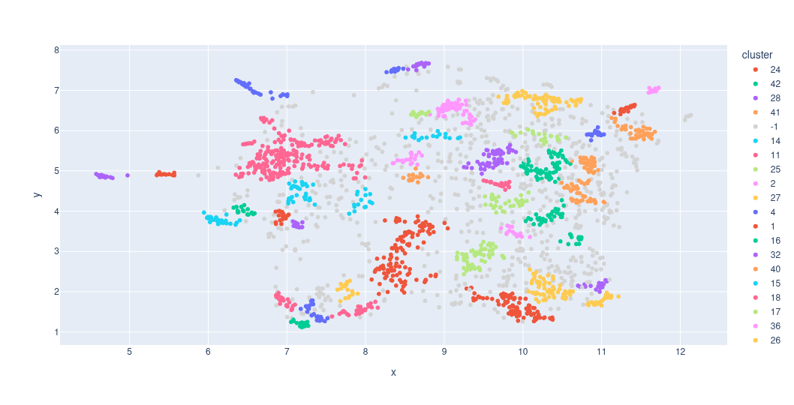

<p align="center">
    
</p>
<h1 align="center">magpie</h1>
<p align="center">A curation of my own watch later videos, powered by machine learning</p>
<p align="center">
    <a href="https://molab.marimo.io/notebooks/nb_oRD5sTmfW1hC8BSTkGBxZM"></a>
    <a href="https://magpie.ishu.foo/"></a>
    <a href="https://api.github.com/repos/cosmognaut/magpie/languages"></a>
    <a href="https://api.github.com/repos/cosmognaut/magpie/languages"></a>
</p>

<p align="center">
    
</p>

## Table of contents
1. [Motivation](https://github.com/cosmognaut/magpie/#motivation)
2. [Architecture](https://github.com/cosmognaut/magpie/#architecture)
3. [Built with](https://github.com/cosmognaut/magpie/#built-with)
4. [Project structure](https://github.com/cosmognaut/magpie/#project-structure)
5. [Development setup](https://github.com/cosmognaut/magpie/#development-setup)
6. [Deployment](https://github.com/cosmognaut/magpie/#deploying-the-application)
7. [Known issues](https://github.com/cosmognaut/magpie/#known-issues)
8. [Quick reference](https://github.com/cosmognaut/magpie/#quick-reference)
9. [Enhancements](https://github.com/cosmognaut/magpie/#enhancements)

## Motivation
I have been using YouTube for about nine years at this point. Over time, my viewing preferences have changed a lot. It can be hard to keep track of those changing preferences, and I would have liked a native way inside YouTube to categorise videos so that I know what I am/was really into at any point.

One might say that the aforementioned categorisation already exists, and they are right - it is the `Category` attribute assigned to every video via YouTube's own machine-learning algorithm. But it's bad - really bad, as it very frequently mis-categorises videos. YouTube as a platform doesn't really care about it, as their entire brand is based on a randomised selection of videos curated for you via a blackbox algorithm.
I think that's fine, but I would really want to know what the current "map" of my interests looks like, especially on a website like YouTube, which I use a lot. They do provide you with a "map" at the end of the year - which is the personalised YouTube rewind for every user. It's more accurate and reflects one's interests faithfully. "What if there was something like that, but available at all times?" - that was my initial thought before starting this project.

## Architecture
We use a `Sentence-Transformers` model to represent video metadata as vectors in a high-dimensional vector space. We then project that space to low dimension for visualisation and clustering, using another model (`UMAP`). We finally use a clustering algorithm (`HDBSCAN`) to classify semantically similar neighbors into a single category. The last step, labeling of the genres, was done manually by myself.


We use the YouTube API v3 to ingest the data from a playlist. The actual watch-later playlist on YouTube does not have a public URL one can use to call the API, so I had to create a separate playlist with the same videos on which the API could be called. The `UMAP` and `HDBSCAN` steps are wrapped together using `sklearn.pipeline.make_pipeline`, and persisted as `genre_pipeline.pkl`  which is the pickle file present inside `backend/`.

**A note on performance measure**: HDBSCAN's `relative_validity_` (DBCV) was initially chosen to be the performance measure for the model, but I quickly realised that it was not a good measure as human evaluation was the only metric that actually mattered for my clusters.

<p align="center">
    
</p>


## Built with
I used `sklearn` (Scikit-Learn) to train the machine learning model (using a pipeline). The vector embeddings were generated using `all-miniLM-L6-v2` from `Sentence-Transformers`. Other algorithms used were `UMAP` for dimensionality reduction and `HDBSCAN` for clustering. I used `pandas` and `numpy` for dataframe manipulation, as well as `plotly` for generating a visualisation. I also used `joblib` to download the trained model. Most of the machine learning steps were done on marimo's molab platform.

The web application was created using Svelte (vanilla, not SvelteKit) + TypeScript using Vite as the build tool/bundler for the user interface; and FastAPI as the backend server, with SQLModel serving as the ORM. The database used was SQLite.

## Project structure
The project is structured around two main folders, for the backend and the user interface respectively. The frontend is simple - we have an `src/` folder inside of which the entire application is written. For the backend, we have a slightly more complex setup with multiple folders; but the main FastAPI app is still served through the backend root, using `main.py`. A snapshot of the project structure is given below. 
```bash
magpie
├── backend
│   ├── app/ # database related utilities
│   ├── data/ # contains the .parquet and .csv files
│   ├── genre_pipeline.pkl # pickle file for the model
│   ├── main.py # main FastAPI app
│   ├── pipeline/ # machine learning pipeline utilities
│   ├── pyproject.toml
│   ├── README.md # unused for now/stub
│   ├── scripts/ # scripts for populating the database
│   ├── test.py # minor dataframe test, irrelevant
│   └── uv.lock
├── frontend
│   ├── index.html
│   ├── package.json
│   ├── package-lock.json
│   ├── public/
│   ├── README.md # autogenerated by vite
│   ├── src/ # main user interface logic
│   ├── svelte.config.js
│   ├── tsconfig.app.json
│   ├── tsconfig.json
│   ├── tsconfig.node.json
│   └── vite.config.ts
└── README.md # you are here
```
## Development setup
In the future, I will write a Dockerfile for the whole project, but right now some things should be done manually here. I am also planning to write a script that automatically populates the database using the trained model later.
1. First, clone the repository
   ```bash
   git clone https://github.com/cosmognaut/magpie.git
   cd magpie
   ```
2. Inside the `backend` directory, you need to first sync all dependencies. `uv` is supported here.
   ```bash
   cd backend
   uv venv # this creates a virtual environment
   source .venv/bin/activate # this activates the virtual environment
   uv sync # actually sync deps
   ```
3. Now for the environment variables - grab your YouTube API key from GCP, making sure that YouTube Data v3 is enabled. Also grab your playlist's ID from its URL. Create a `.env` inside the backend root folder.
   ```bash
   touch .env
   vim .env
   ```
   Inside the file, it should have something like this:
   ```env
   YOUTUBE_API_KEY=AI...
   PLAYLIST_ID=PL...
   ```
4. You will find a `/scripts` directory here. We will use this to populate the database. You may also find a `genre_pipeline.pkl` pickle file which is the trained machine learning model. You may not use this for now, as the relevant `.parquet` files are already present inside the `/data` folder. But if you still want to edit the genre names and label the clusters yourself, you may edit the `genre_assignment.py` file.
   ```bash
   vim scripts/genre_assignment.py # to name the clusters
   uv run -m scripts.genre_assignment # to generate the assigned_genres.parquet file - this should already be present inside the data/ folder
   ```
5. Now we will actually populate the database. We are using a simple `sqlite` database here, powered by the `SQLModel` ORM. Use the following commands:
   ```bash
   uv run -m scripts.main # creates and populates the database, note that the genres have NOT been assigned yet
   uv run -m app.test_db # to test if the database is populated - you will NOT see any genres yet
   uv run -m pipeline.genres # to actually assign the genres in the database
   uv run -m app.test_db # the videos should have genres now
   ```
   If you are getting any empty videos in this step (i.e. videos that don't have a genre), this is because it was added to the database after the last clustering run and needs to be re-processed. I am working on finding a pragmatic fix for this, a great fix would probably be training a classifier based on the existing dataset.
6. You're ready to serve the endpoint now. Just use FastAPI here, the entrypoint has already been set to `main:app`.
   ```bash
   fastapi dev
   ```
7. Now visit `http://127.0.0.1:8000/api/health` to see if the endpoint is running. You should see a `status: ok` message. You are now serving the videos via the endpoint at `http://127.0.0.1:8000/videos/`.
8. Now we will shift our attention to the user interface. First, go into the frontend directory and install dependencies:
    ```bash
    cd .. # you should now be at the root
    cd frontend
    npm ci
    ```
9. For local development setups, you can use Vite
   ```bash
    npx vite
    ```
The user interface should now be available at `http://localhost:5173/` - it depends on your port.
## Deploying the application
The project has been deployed using FastAPI Cloud. This makes it really easy to deploy the app via the command line. I am considering adding GitHub Actions CI later that deploys this on every push. 
To deploy the project locally for now, you can follow the below steps:
1. Make sure that you're in the frontend directory.
   ```bash
   cd frontend
   ```
2. Build the user interface and move the folder to the backend folder.
   ```bash
    rm -rf ../backend/dist/  # only if a previous deploy's dist/ still exists
    npm run build
    mv dist/ ../backend/
    ```
   FastAPI Cloud requires you to have the `dist/` folder in the same directory as the main FastAPI app. That's the reason for moving the `dist/` folder inside `backend/`.
3. Because the `.fastapicloudignore` is already present, you can simply run the below commands.
   ```bash
   cd ../backend # you should now be inside the backend folder
   fastapi deploy
   ```
That's it! `fastapi deploy` makes it really easy for you to deploy your applications.

## Known issues
This can still be considered as a v0 for the project. As such, there are some known issues that may arise while developing or interacting with the application.
- If the database has more videos than the number used to train the model (2339), some videos just don't get a genre. This is NOT intended and happens because some row id's are simply omitted when we run `uv run -m pipeline.genre` to populate the database with genres. The main source of the problem is the `clustered_watch_later.parquet` file inside `data/`. This file was generated after the model was trained on the videos and was downloaded from molab. A fix would be to train a classifier on the existing videos and labels and get it to categorise new videos after the database is populated.
- The backend still doesn't have a unified script that auto-populates the database - that was the entire point of having the `scripts/` folder. A fix would be to create such a file and replace the six-or-so steps currently required to just run the backend.

## Quick reference
I am assuming you are present in the root folder (i.e. `.`, neither `frontend/` nor `backend/`). This is a quick reference for some common tasks you may need to perform:
- Popualte the database
  ```bash
  cd backend
  uv run -m scripts.main # assuming you already have a .env here
  uv run -m pipeline.genres # add genres
  uv run -m app.test_db # test DB
  ```
- Redeploy the application
  ```bash
  cd frontend
  npm run build
  rm -rf ../backend/dist/ # if there is a dist/ from a previous deploy
  mv dist/ ../backend/
  cd ..
  cd backend
  fastapi deploy
  ```
## Enhancements
There is already a "magpie enhancement proposals" file inside `frontend/src/`, but this one supersedes that. This list may also include some TODOs. Some enhancemeents I could do to make this project better include, in no particular order:
- A classifier trained on existing video data that fixes the current issue of newer videos not being assigned a genre.
- A unified database script to make things cleaner to develop. (Priority)
- Use some other model to generate the embeddings just to test if it results in more accurate vectors (in terms of semantic similarity).
- Use GitHub actions for continuous integration; i.e. on a commit the project gets deployed.
- Write a Dockerfile to make the project easier to develop.
- Fuzzy search using Fuse.js. I had this idea after discussing genre search with Claude. I am implementing this on my own right now, but later in the future I would want to add fuzzy search for genres, as well as the video titles using that library.
- Semantic search across the entire database. This means that I would need to revamp by sqlite database to also store the "final string" column of my pandas dataframe. Or I could use a vector database, but I really don't want to do that. I could take a query from the user and run a fuzzy search across the final strings field of my database and display the relevant results. It'd also teach me much about optimising for quick data lookup.
- In-app video player using the YouTube iframe API.
