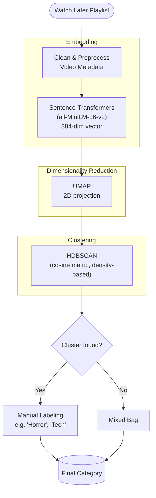

<p align="center">
    
</p>
<h1 align="center">magpie</h1>
<p align="center">A curation of my own watch later videos, powered by machine learning</p>
<p align="center">
    <a href="https://molab.marimo.io/notebooks/nb_oRD5sTmfW1hC8BSTkGBxZM"></a>
    <a href="https://magpie.ishu.foo/"></a>
    <a href="https://api.github.com/repos/cosmognaut/magpie/languages"></a>
    <a href="https://api.github.com/repos/cosmognaut/magpie/languages"></a>
</p>
What if there was a way to do that?

## Architecture
We use a `Sentence-Transformers` model to represent video metadata as vectors in a high-dimensional vector space. We then project that space to low dimension for visualisation and clustering, using another model (`UMAP`). We finally use a clustering algorithm (`HDBSCAN`) to classify semantically similar neighbors into a single category. The last step, labeling of the genres, was done manually by myself.


## Development setup
In the future, I will write a Dockerfile for the whole project, but right now some things should be done manually here. I am also planning to write a script that automatically populates the database using the trained model later.
1. First, clone the repository
   ```bash
   git clone https://github.com/cosmognaut/magpie.git
   cd magpie
   ```
2. Inside the `backend` directory, you need to first sync all dependencies. `uv` is supported here.
   ```bash
   cd backend
   uv venv # this creates a virtual environment
   source .venv/bin/activate # this activates the virtual environment
   uv sync # actually sync deps
   ```
3. You will find a `/scripts` directory here. We will use this to populate the database. You may also find a `genre_pipeline.pkl` pickle file which is the trained machine learning model. You may not use this for now, as the relevant `.parquet` files are already present inside the `/data` folder. But if you still want to edit the genre names and label the clusters yourself, you may edit the `genre_assignment.py` file.
   ```bash
   vim scripts/genre_assignment.py # to name the clusters
   uv run -m scripts.genre_assignment # to generate the assigned_genres.parquet file - this should already be present inside the data/ folder
   ```
4. Now we will actually populate the database. We are using a simple `sqlite` database here, powered by the `SQLModel` ORM. Use the following commands:
   ```bash
   uv run -m scripts.main # creates and populates the database, note that the genres have NOT been assigned yet
   uv run -m app.test_db # to test if the database is populated - you will NOT see any genres yet
   uv run -m pipeline.genres # to actually assign the genres in the database
   uv run -m app.test_db # the videos should have genres now
   ```
   If you are getting any empty videos in this step (i.e. videos that don't have a genre), this is because it was added to the database after the last clustering run and needs to be re-processed. I am working on finding a pragmatic fix for this, a great fix would probably be training a classifier based on the existing dataset.
5. You're ready to serve the endpoint now. Just use FastAPI here, the entrypoint has already been set to `main:app`.
   ```bash
   fastapi dev
   ```
6. Now visit `http://127.0.0.1:8000/api/health` to see if the endpoint is running. You should see a `status: ok` message. Your'e now serving the videos via the endpoint at `http://127.0.0.1:8000/videos/`.
7. Now we will shift our attention to the user interface. First, go into the frontend directory and install dependencies:
    ```bash
    cd .. # you should now be at the root
    cd frontend
    npm ci
    ```
8. For local development setups, you can use Vite
   ```bash
    npx vite
    ```
The user interface should now be available at `http://localhost:5173/` - it depends on your port.
## Deploying the application
The project has been deploying using FastAPI Cloud. This makes it really easy to deploy the app via the command line. I am considering adding GitHub Actions CI later that deploys this on every push. 
To deploy the project locally for now, you can follow the below steps:
1. Make sure that you're in the frontend directory.
   ```bash
   cd frontend
   ```
2. Build the user interface and move the folder to the backend folder.
   ```bash
    rm -rf ../backend/dist/  # only if a previous deploy's dist/ still exists
    npm run build
    mv dist/ ../backend/
    ```
   FastAPI Cloud requires you to have the `dist/` folder in the same directory as the main FastAPI app. That's the reason for moving the `dist/` folder inside `backend/`.
3. Because the `.fastapicloudignore` is already present, you can simply run the below commands.
   ```bash
   cd .. # you should now be inside the backend folder
   fastapi deploy
   ```
That's it! `fastapi deploy` makes it really easy for you to deploy your applications.

## Todos
- [ ] Write this README, use mermaid for a diagram. 
- [ ] Use GitHub actions for continuous integration , i.e. on a commit the project gets deployed.
- [ ] Write a dockerfile later.
- [ ] Unified database script
